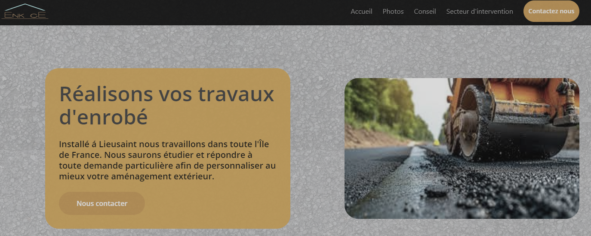

# Enk enrobe wibesite

## preview

## enk-hugo

we use [hugo](https://gohugo.io/) and [hugo-fresh](https://github.com/StefMa/hugo-fresh) theme (we require Bulma-based V0.9.4 [theme](./enk-hugo/themes/README.md) of the same name from CSS Ninja.)
